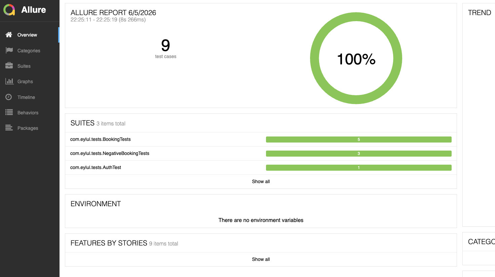
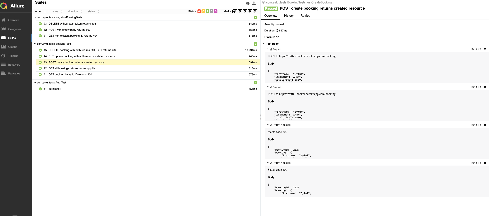

# API Test Framework

REST Assured API test framework built from scratch using Java 21, JUnit 5, and Maven.

## Test Report




Tests are reported using [Allure](https://allurereport.org). To generate the report locally:

```bash
mvn clean test allure:report
open target/site/allure-maven-plugin/index.html
```

## CI/CD

Tests run automatically on every push to `main` via GitHub Actions.

Live Allure report: [https://eylulakar.github.io/api-test-framework/](https://eylulakar.github.io/api-test-framework/)